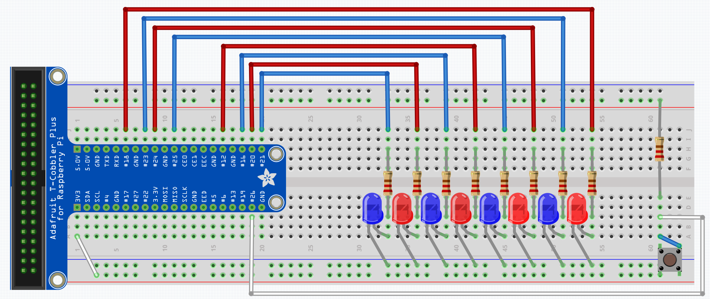

<div id="readme-top"></div>

<!-- PROJECT TITLE -->

<br />
<div align="center">
  <h3 align="center">Raspberry Pi Stacker Game</h3>
</div>

<!-- BUILT WITH -->

## Built With


<p align="right">(<a href="#readme-top">back to top</a>)</p>

<!-- OVERVIEW -->

## Overview

Welcome to the Raspberry Pi Stacker Arcade Game! This application lets you build and play the popular arcade game "Stacker" using your Raspberry Pi connected to a breadboard. This application helps students to learn more about electronics and programming through hands-on experience.

<p align="right">(<a href="#readme-top">back to top</a>)</p>

<!-- HIGHLIGHTS -->

## Highlights

- **Build with Raspberry Pi**: Step-by-step instructions to set up your Raspberry Pi with a breadboard.
- **Interactive Gameplay**: Enjoy playing Stacker just like you would in an arcade.
- **Educational Tool**: Learn about GPIO pin control, electronics, and basic game programming in a fun way.

<br>

I hope this application helps you better understand your Raspberry Pi electronics!

<p align="right">(<a href="#readme-top">back to top</a>)</p>

<!-- BREADBOARD SETUP -->

## Breadboard Setup

To play the Stacker game, you'll need to assemble the breadboard hardware and connect it to your Raspberry Pi like the illuartation below.



### Materials Required

- **1 Raspberry Pi**: Ideally version 4 or newer.
- **1 Breadboard**: Preferably similar size to above.
- **12 Jumper wires**: Any color or size.
- **8 LEDs**: At least 3 for the stacker blocks.
- **1 Push buttons**: For game input (e.g., Start/Select).
- **9 Resistors**: Various values to protect the LEDs and buttons.

---

### Hardware Assembly

1. **Connect LEDs to GPIO pins:**
   - Insert the LEDs into the breadboard.
   - Use a resistor for each LED to limit current.
   - Connect the longer leg (anode) of each LED to a unique GPIO pin on the Raspberry Pi.
   - Connect the shorter leg (cathode) to the ground (GND).

2. **Set up push buttons:**
   - Insert the push buttons into the breadboard.
   - Use a pull-down resistor to connect one terminal of each button to ground.
   - Connect the other terminal of each button to a unique GPIO pin on the Raspberry Pi.

3. **Power the breadboard:**
   - Use jumper wires to connect the power (3.3V) and ground (GND) pins of the Raspberry Pi to the breadboard's power rails.

---

### GPIO Pin Configuration

For a quick reference, here's the GPIO pin mapping used in the application:

| COMPONENT          | GPIO PIN |
|--------------------|----------|
| BUTTON             | GPIO 4   |
| RED LED 1          | GPIO 18  |
| BLUE LED 1         | GPIO 23  |
| RED LED 2          | GPIO 24  |
| BLUE LED 2         | GPIO 25  |
| RED LED 3          | GPIO 12  |
| BLUE LED 3         | GPIO 16  |
| RED LED 4          | GPIO 20  |
| BLUE LED 4         | GPIO 21  |

<p align="right">(<a href="#readme-top">back to top</a>)</p>

<!-- SOFTWARE SETUP -->

## Software Setup

This project is available in two versions: one written in C and another in ARM Assembly. Below are the instructions on how to set up and run each version on your Raspberry Pi.

<!-- PREREQUISITES -->

### Prerequisites

Before proceeding with either version, ensure the following tools are installed on your Raspberry Pi:

- **GCC Compiler (gcc)**: Required for compiling C programs.
  ```sh
  sudo apt-get install gcc
  ```
  
- **GNU Assembler (as)**: Required for compiling ARM Assembly programs.
  ```sh
  sudo apt-get install binutils
  ```

- **Make**: To use the Makefile for building the projects.
  ```sh
  sudo apt-get install make
  ```

---

<!-- COMMON SETUP -->

### Common Setup

To clone the repository onto your Raspberry Pi follow these steps.

1. **Clone the stacker repository from GitHub**
   ```sh
   git clone https://github.com/austin-cavanagh/stacker.git
   ```

2. **Navigate to the stacker directory**
   ```sh
   cd stacker
   ```

---

<!-- C VERSION SETUP -->

### C Version Setup

1. **Navigate to the C version directory:**
   ```sh
   cd c_version
   ```

2. **Use the C version Makefile's `run` command to build and run the game:**
     ```sh
     make run
     ```

3. **Clean the C version build directory if needed:**
     ```sh
     make clean
     ```
---

<!-- ARM ASSEMBLY VERSION SETUP -->

### ARM Assembly Version Setup

1. **Navigate to the ARM Assembly version directory:**
   ```sh
   cd asm_version
   ```

2. **Use the ARM Assembly version Makefile's `run` command to build and run the game:**
     ```sh
     make run
     ```

3. **Clean the ARM Assembly version build directory if needed:**
     ```sh
     make clean
     ```

<p align="right">(<a href="#readme-top">back to top</a>)</p>

<!-- HOW TO PLAY -->

## How to Play

Below are the rules and a step-by-step explanation of how to play the **Raspberry Pi Stacker Game** game:

### Starting the Game
1. When the program is run, a **starting animation** will play:
   - The LEDs will light up one at a time in sequence from bottom to top.
   - After reaching the last LED, the sequence will reverse and light up the LEDs from top to bottom.
   - This animation will continue looping until the player presses the button, signaling they are ready to play.

2. Once the button is pressed, the game begins, starting with the first LED blinking.

---

### Gameplay

1. **Objective**:
   - Your goal is to light up all the LEDs in the row by pressing the button at the correct time.

2. **How to Play**:
   - The first LED will start blinking.
   - **Press the button while the LED is ON** to lock it in place and proceed to the next LED.
   - If you **press the button while the LED is OFF**, you lose, and all previously lit LEDs will turn off. You'll need to restart from the first LED.

3. **Progression**:
   - As you successfully light up each LED, the game will move to the next LED in the sequence.
   - Continue this process until all LEDs in the row are lit to win the game.

---

### Winning and Ending Animation
1. **Winning the Game**:
   - Once all LEDs are successfully lit, you win the game.

2. **Ending Animation**:
   - After you win, an **ending animation** will play:
     - All blue LEDs will turn on, followed by all red LEDs.
     - This sequence will repeat 10 times before the program ends.

<p align="right">(<a href="#readme-top">back to top</a>)</p>

<!-- CONTACT -->

## Contact

Austin Cavanagh - <a href="https://github.com/austin-cavanagh" target="_blank">GitHub</a> - <a href="https://www.linkedin.com/in/austincavanagh/" target="_blank">LinkedIn</a> - austin.cavanagh.cs@gmail.com

<p align="right">(<a href="#readme-top">back to top</a>)</p>

<!-- LICENSE -->

## License

Distributed under the MIT License. See [LICENSE.txt](LICENSE.txt) for more information.

<p align="right">(<a href="#readme-top">back to top</a>)</p>